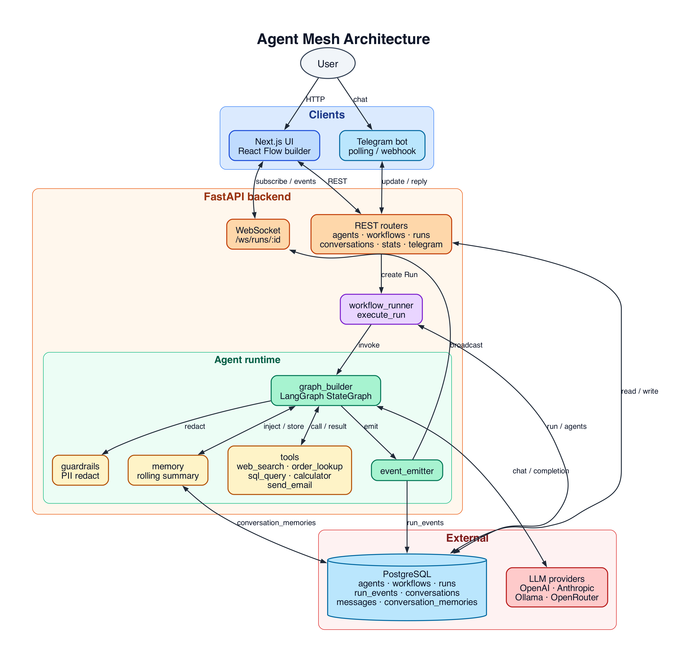

# AI Agent Orchestration Platform

Agent Mesh is a local-first platform for configuring agents, wiring them into LangGraph workflows, and watching runs stream live from the browser or Telegram. Four workflow templates ship out of the box (sequential support triage, research → summarize, conditional Smart Router, and a Draft & Review feedback loop), with rolling per-conversation memory, PII guardrails, agent skills, workflow interaction rules, and cron-based scheduling enforced at the runtime level.

## Demo

Demo video: [Watch the Agent Mesh walkthrough](https://drive.google.com/file/d/136SRRwGF5nNbo2ijOUDcOs2wRLKmQRJB/view?usp=sharing).

Four pre-built workflow templates ship with the app:

- **Customer Support Triage** — Triage Agent → Support Specialist, with `order_lookup` + `web_search` tools.
- **Research & Summarize** — Researcher Agent (forced `web_search`) → Summarizer Agent.
- **Smart Router** — Triage Agent emits `ROUTE: billing|technical|general` and a conditional edge dispatches to the matching specialist; `condition.always: true` is the catch-all.
- **Draft & Review** — Drafter writes, Reviewer evaluates and emits `ROUTE: approve|revise`. The runtime loops back to Drafter on `revise` and exits to `END` on `approve` (Reviewer's own prompt caps the loop at 2 revisions; runtime `recursion_limit=25` bounds it absolutely).

## Architecture



> Source: [`docs/architecture.dot`](docs/architecture.dot). Rebuild the image with `dot -Tpng -Gdpi=160 docs/architecture.dot -o docs/architecture.png` (requires `graphviz`).

### Why these choices

- **LangGraph over CrewAI/AutoGen** because the demo needs explicit state transitions, native async execution, durable event checkpoints, and a simple single-process runtime that is easy to inspect during a live run. `add_conditional_edges` is also a clean fit for the Smart Router template.
- **FastAPI + Postgres** because Pydantic keeps the API contract tight, SQLAlchemy async fits the runtime, and Postgres JSON columns are a good match for flexible agent config and workflow graphs.
- **Pluggable model providers** — agents call OpenAI-compatible endpoints (OpenAI, Ollama, OpenRouter, Groq) by default. Anthropic models route through `langchain_anthropic.ChatAnthropic` instead. Either path uses the same agent definition, so the choice of model is per-agent and per-run.
- **Telegram polling for local demo** because it avoids ngrok and public HTTPS setup. The webhook endpoint is included for production-style deployment, where Telegram can call a public URL.
- **Single Postgres instead of Postgres + Redis + Qdrant** because this demo does not need RAG, Celery, or cross-replica WebSocket fanout. Fewer moving parts makes the cold-start demo much more reliable.

## Quick Start

```bash
cp backend/.env.example backend/.env
# Required: OPENAI_COMPATIBLE_API_KEY
# Optional: TAVILY_API_KEY (web_search falls back to DuckDuckGo if blank)
# Optional: TELEGRAM_BOT_TOKEN + TELEGRAM_DEFAULT_WORKFLOW_ID for the Telegram path
# Optional: AUTH_USERNAME + AUTH_PASSWORD + AUTH_SECRET to enable login
docker compose up --build
```

- UI: `http://localhost:3000`
- API docs: `http://localhost:8000/docs`
- Health: `http://localhost:8000/health`

On first boot, the backend logs the seeded Customer Support Triage workflow id and writes it to `backend/.telegram_workflow_id`. Copy that value into `backend/.env` as `TELEGRAM_DEFAULT_WORKFLOW_ID`, then restart the backend to enable Telegram routing.

### GCP VM Performance Notes

For an `e2-medium`, keep the stack in production mode:

```bash
git pull
docker compose up -d --build
```

The frontend image uses Next.js standalone output, and the backend image runs Uvicorn without `--reload`. Keep a single backend process for this demo because Telegram polling and APScheduler run inside the API process; scaling workers without splitting those services can duplicate polling or scheduled jobs.

If the UI still feels slow, check these first:

- Use a nearby GCP region for your reviewers and for outbound LLM calls.
- Keep Postgres on the same VM for the demo, or move it to Cloud SQL only if the VM is CPU/memory constrained.
- Watch `docker stats`; if memory is tight, upgrade temporarily to `e2-standard-2` for the demo window.
- Avoid open run pages during heavy workflow execution if the VM is pegged; WebSocket streaming and LLM calls share the same small CPU.

### Telegram Bot Commands

Demo bot: [`@agent_mesh_poc_bot`](https://t.me/agent_mesh_poc_bot).

Once polling is running, users can switch workflows per chat:

- `/start` — welcome message with setup instructions and workflow picker
- `/workflows` — inline keyboard listing every seeded workflow; tap one to select it for this chat, then send normal messages to talk to that workflow
- `/current` — show which workflow this chat is using (and whether the choice is per-chat or the server default)
- `/help` — command list

The per-chat selection is stored on the `conversations` row (`workflow_id` column). If a chat never picks one, messages fall back to `TELEGRAM_DEFAULT_WORKFLOW_ID`.

## Model Setup

The default config uses OpenAI's `gpt-5-nano` through the OpenAI-compatible adapter:

```env
LLM_PROVIDER=openai_compatible
OPENAI_COMPATIBLE_API_KEY=sk-...
OPENAI_COMPATIBLE_BASE_URL=https://api.openai.com/v1
OPENAI_COMPATIBLE_MODEL=gpt-5-nano
DEFAULT_MODEL=gpt-5-nano
REQUIRE_ANTHROPIC_ON_STARTUP=false
INPUT_COST_PER_1K=0.00005
OUTPUT_COST_PER_1K=0.0004
```

### Free And Open-Weight Models

The runtime also supports any OpenAI-compatible endpoint.

For a truly free local setup, install Ollama and pull an open-weight model:

```bash
ollama pull qwen2.5:7b
```

Then set:

```env
LLM_PROVIDER=openai_compatible
OPENAI_COMPATIBLE_API_KEY=ollama
OPENAI_COMPATIBLE_BASE_URL=http://host.docker.internal:11434/v1
OPENAI_COMPATIBLE_MODEL=qwen2.5:7b
DEFAULT_MODEL=qwen2.5:7b
REQUIRE_ANTHROPIC_ON_STARTUP=false
INPUT_COST_PER_1K=0
OUTPUT_COST_PER_1K=0
```

Good local starter models:

- `qwen2.5:7b` - best first pick for tool-heavy demos on a laptop.
- `llama3.1:8b` - strong general model if your machine has enough memory.
- `mistral:7b` - smaller, fast, and usually good enough for a demo.

Hosted free options can work too, but have rate limits and availability changes. For OpenRouter, use an API key and a `:free` model:

```env
LLM_PROVIDER=openai_compatible
OPENAI_COMPATIBLE_API_KEY=your_openrouter_key
OPENAI_COMPATIBLE_BASE_URL=https://openrouter.ai/api/v1
OPENAI_COMPATIBLE_MODEL=qwen/qwen3-32b:free
DEFAULT_MODEL=qwen/qwen3-32b:free
REQUIRE_ANTHROPIC_ON_STARTUP=false
```

For local Telegram, keep:

```env
TELEGRAM_MODE=polling
```

For webhook deployments, set `TELEGRAM_MODE=webhook`, set `TELEGRAM_WEBHOOK_URL` to a public HTTPS URL, and configure Telegram to POST to `/api/v1/telegram/webhook`.

## Auth Setup

Auth is disabled by default for local demos. To enable the static-user login screen, set all three values and restart the backend:

```env
AUTH_USERNAME=admin
AUTH_PASSWORD=change-me
AUTH_SECRET=use-a-long-random-string
```

The frontend stores a 7-day HMAC-signed bearer token in `localStorage` and attaches it to protected API calls and run WebSocket URLs. Public endpoints remain `/health`, `/api/v1/auth/*`, and the Telegram webhook.

## Running The Demo

1. Open `http://localhost:3000` and confirm the dashboard metrics, 7-day token trend, and per-agent spend table all render.
2. Open `/agents` and review the seeded agents (Triage, Support Specialist, Researcher, Summarizer, Orchestrator, Smart Router Triage, Billing/Technical/General Specialists). Each agent shows its skill chips and assigned tools.
3. Open `/workflows`, edit any template, and confirm React Flow renders the graph. `Smart Router` is the conditional-edge demo and `Customer Support Triage` is the Telegram default.
4. Run **Customer Support Triage** with an order question:

   ```text
   Hi, I placed order ORD-1042 three days ago and the tracking link isn't working. Can you check the status and tell me what the standard delivery window is for international orders?
   ```

5. Run **Smart Router** three times to exercise conditional routing:

   ```text
   I was charged twice on invoice INV-9012, please refund.        # → Billing Specialist
   My API integration is returning 503 errors on /v1/orders.      # → Technical Specialist
   How do I change my account display name?                       # → General Support Specialist
   ```

6. Trigger the PII guardrail by including an email + phone in the user input — a `guardrail_triggered` event appears in the run timeline with `EMAIL`/`PHONE` counts.
7. Watch `/runs/{id}` stream every event type: `run_started`, `node_started`, `llm_call`, `tool_call`, `tool_result`, `agent_message`, `guardrail_triggered`, `memory_updated` (Telegram only), `node_completed`, `run_completed`.
8. Open [`@agent_mesh_poc_bot`](https://t.me/agent_mesh_poc_bot), send `/start` to see instructions, then send `/workflows` and pick a workflow. After selection, send a normal chat message; the selected workflow runs and replies in Telegram. Open `/conversations`, click the Telegram conversation, and use the `View run` link on the agent reply. Send a second message in the same chat to see the rolling summary picked up.

## Agent Skills

Each agent carries a `config.skills` array of free-form capability labels (e.g. `["copywriting", "summarization", "routing"]`). Skills are:

- Displayed as violet chips in the Agents table and on the React Flow node inside the workflow editor.
- Editable in the agent form (Skills field — comma-separated, parsed on save).
- Stored in `agent.config.skills` (JSON column) and returned by `GET /api/v1/agents`.

Skills are intentionally open-ended — they are not enforced by the runtime; they exist for documentation, visual clarity in the editor, and future routing/matching logic.

## Workflow Interaction Rules

Each workflow graph carries a `config.interaction_rules` object that controls how the LangGraph runtime bounds a run:

```json
{
  "max_iterations_per_agent": 3,
  "max_total_steps": 25
}
```

- `max_iterations_per_agent` — maximum LLM retries an agent node makes before giving up (default 3). Prevents a single agent from looping on tool errors indefinitely.
- `max_total_steps` — maps directly to LangGraph's `recursion_limit` (default 25). Caps the total number of graph steps across all nodes in a single run, which is the hard bound for feedback loops.

Both values are editable from the workflow editor's **Interaction rules** panel (amber section in the right-hand inspector when no node or edge is selected).

## Workflow Scheduling

Each workflow can be given a cron schedule via `graph.config.schedule`:

```json
{
  "enabled": true,
  "cron": "0 9 * * *",
  "input": "Run the daily summary.",
  "timezone": "UTC"
}
```

The backend runs an `APScheduler AsyncIOScheduler` that registers one job per enabled workflow on startup and after any workflow PATCH. Scheduled runs insert a `Run` row with `trigger.source = "schedule"` and fire through the same `execute_run` path as manual and Telegram triggers.

The schedule is editable from the workflow editor's **Schedule** panel (sky-blue section in the right-hand inspector).

## What's Implemented Vs Stubbed

| Area | Status |
| --- | --- |
| Agent CRUD | Implemented |
| Agent skills (capability labels) | Implemented |
| Workflow CRUD | Implemented |
| Visual workflow builder | Implemented with React Flow |
| Conditional edges / routing | Implemented (see `Smart Router` template) |
| Feedback loop edges | Implemented (purple double-arrow, `ui.feedback: true`) |
| Workflow interaction rules | Implemented (`max_iterations_per_agent`, `max_total_steps`) |
| Workflow cron scheduling | Implemented (APScheduler, `graph.config.schedule`) |
| LangGraph runtime | Implemented |
| Claude / OpenAI agent calls | Implemented |
| Runtime error classification | Implemented (9 categories: auth, rate_limit, context_length, tool, timeout, output, graph, budget, unknown) |
| `order_lookup` tool | Implemented deterministic demo tool |
| `web_search` tool | Implemented (Tavily preferred, DDG fallback chain) |
| PII guardrails | Implemented (`guardrails.pii: redact` on agent config) |
| Rolling conversation memory | Implemented per (conversation, agent) |
| Live run timeline | Implemented over WebSocket |
| Telegram polling | Implemented |
| Telegram webhook route | Implemented, production path only |
| Conversations transcript | Implemented |
| Dashboard metrics + spend trend | Implemented (7-day token trend + per-agent cost) |
| Static-user auth | Implemented (optional, env-gated) |
| Delete workflow | Implemented (with `?force=true` cascade) |
| Multi-tenancy | Stubbed/deferred |
| Slack/WhatsApp | Stubbed/deferred (see [docs/EXTENDING.md](docs/EXTENDING.md)) |
| RAG/vector DB | Stubbed/deferred |

## Runtime Error Classification

When a run fails, the runtime classifies the exception into one of nine categories and surfaces a structured error event with a human-readable hint:

| Category | Trigger | Example hint |
| --- | --- | --- |
| `auth` | 401/403 from LLM provider | Check API key. |
| `rate_limit` | 429 / rate limit text | Reduce concurrency or upgrade quota. |
| `context_length` | 400 + context/token overflow text | Shorten system prompt or input. |
| `tool` | Tool call raised an exception | Check tool configuration. |
| `timeout` | asyncio/httpx timeout | Increase timeout or retry. |
| `output` | Empty or missing agent output | Agent produced no text; check prompt. |
| `graph` | LangGraph recursion limit hit | Increase max_total_steps or add exit. |
| `budget` | Token budget exceeded | Reduce input or increase budget. |
| `unknown` | Anything else | (raw exception message) |

The `run_completed` (with `status: failed`) event carries `category`, `message`, and `hint` so the run timeline can display a color-coded card instead of a raw stack trace.

## Project Structure

- `backend/app/main.py` — FastAPI bootstrap (router mount, DB init, seed, Telegram lifecycle, scheduler lifecycle).
- `backend/app/api/` — REST routers: `agents`, `workflows`, `runs`, `conversations`, `telegram`, `stats`, `auth`.
- `backend/app/auth.py` — HMAC-SHA256 token creation/verification, `get_current_user` dependency.
- `backend/app/scheduler.py` — APScheduler cron job registration and reload.
- `backend/app/integrations/telegram_bot.py` — shared Telegram polling + webhook handling (forwards `conversation_id` into the runner for memory).
- `backend/app/runtime/` — workflow runtime:
  - `graph_builder.py` — LangGraph `StateGraph` build, conditional edges, route extraction, `max_iterations_per_agent` enforcement.
  - `workflow_runner.py` — Run lifecycle, memory summarization, event totals, error classification.
  - `errors.py` — `ClassifiedError` dataclass + `classify(exc)` function (9 categories).
  - `tools.py` — tool implementations + `TOOL_REGISTRY` (web_search, order_lookup, sql_query, calculator, send_email).
  - `guardrails.py` — PII redaction.
  - `memory.py` — rolling-summary read/write.
  - `event_emitter.py` — persist `RunEvent` + WebSocket broadcast.
- `backend/app/models/` — SQLAlchemy models (`agents`, `workflows`, `runs`, `run_events`, `conversations`, `messages`, `conversation_memories`).
- `backend/app/schemas/` — Pydantic request/response models.
- `backend/alembic/versions/` — schema migrations (`0001` initial → `0003` memory + guardrail event types).
- `backend/tests/` — `test_contract.py` (REST + WebSocket) and `test_runtime.py` (graph build, tools, guardrails, routing, memory, interaction rules, scheduler, error classification).
- `frontend/app/` — Next.js App Router pages (dashboard, agents, workflows, runs, conversations, login, settings).
- `frontend/components/workflow/` — React Flow nodes (agent chips + skill pills), palette, edge styling, node/edge inspector.
- `frontend/lib/api-client.ts` — typed fetch wrapper with auth token attachment and 401 redirect.
- `docs/EXTENDING.md` — how to add tools, templates, channels, guardrails.

## Conditional Edges

Workflow edges support a `condition` object so that an upstream agent's decision can pick the next node:

```json
{
  "from": "triage",
  "to": "billing",
  "condition": {"route_equals": "billing"},
  "label": "billing"
}
```

The runtime parses `ROUTE:` or `CATEGORY:` lines from the last agent message and stores the value in workflow state. Edges with `condition.always: true` act as the catch-all default. Target `END` (case-insensitive aliases: `__end__`, `exit`, `finish`, `done`) terminates the run. See the seeded `Smart Router` template for a fan-out and `Draft & Review` for a feedback loop.

## Visual Editor — Authoring Feedback Loops

The React Flow workflow editor (`/workflows/<id>/edit`) renders nodes, edges, and a virtual **END** sink. Click any edge to open the inspector and choose its semantics:

- **Straight** — plain animated arrow, runs unconditionally after the source.
- **Conditional** — dashed amber arrow, fires when the source agent emits `ROUTE: <value>` matching the configured value.
- **Catch-all** — dashed gray arrow with `condition.always: true`, fires when no other route matches the source.
- **Feedback loop** (checkbox at the top of the edge panel) — one-click loop-back. Auto-forces conditional routing with `route_equals: "revise"` (override per edge if needed) and renders the edge as a **purple double-arrow** so the cycle is visually obvious.

To wire `Drafter ⇄ Reviewer`:

1. Drop the two agents.
2. Draw `Drafter → Reviewer` (plain forward edge).
3. Draw `Reviewer → Drafter`, click the edge, tick **Feedback loop**. The route defaults to `revise`; change it if your reviewer emits something else.
4. Drag the **END** pill from the palette (under "Flow control") and draw `Reviewer → END` as a Catch-all so the run completes when the reviewer approves.

The "Run path / Feedback" toggle is gone; one connection mode handles everything and the edge inspector decides the meaning. Edges save as `{from, to, condition?, label?, ui?}` — `ui.feedback: true` is what the editor reads to re-render the double-arrow on next load.

## Memory And Guardrails

- Memory: when an agent is configured with `memory_enabled: true` and the run is tied to a `conversation_id` (Telegram conversations always are), the runtime injects a rolling summary into the system prompt and rewrites that summary after the run completes. Storage: `conversation_memories` table.
- PII guardrails: agents with `config.guardrails.pii = "redact"` get email, phone, credit card, and IPv4 patterns redacted from incoming human messages before the LLM call. A `guardrail_triggered` event is emitted whenever a redaction fires so it is visible in the live run timeline.

## Tests

```bash
cd backend
PYTHONPATH=. pytest
```

The end-to-end `test_run_completes_end_to_end` is marked `integration` and skips unless a real LLM API key is set (`ANTHROPIC_API_KEY` for the Anthropic path, or a working `OPENAI_COMPATIBLE_API_KEY` env for the OpenAI-compatible path). Unit coverage includes graph build, PII redaction, route extraction, conditional routing, memory injection, interaction rules propagation, scheduler schedule extraction, and all 9 error classification categories.

## Production Roadmap

- Replace static-user auth with workspace-aware auth, roles, and tenant isolation.
- Move WebSocket fanout to Redis for multi-replica deployments.
- Add a vector database only when an agent actually needs RAG.
- Add richer schedule management UI (calendar view, pause/resume history, retry policy).
- Add tracing (OpenTelemetry) for model latency and per-tool spans.
- Add secrets management for channel tokens and provider keys.
- Add durable background workers if runs need to outlive the API process.
