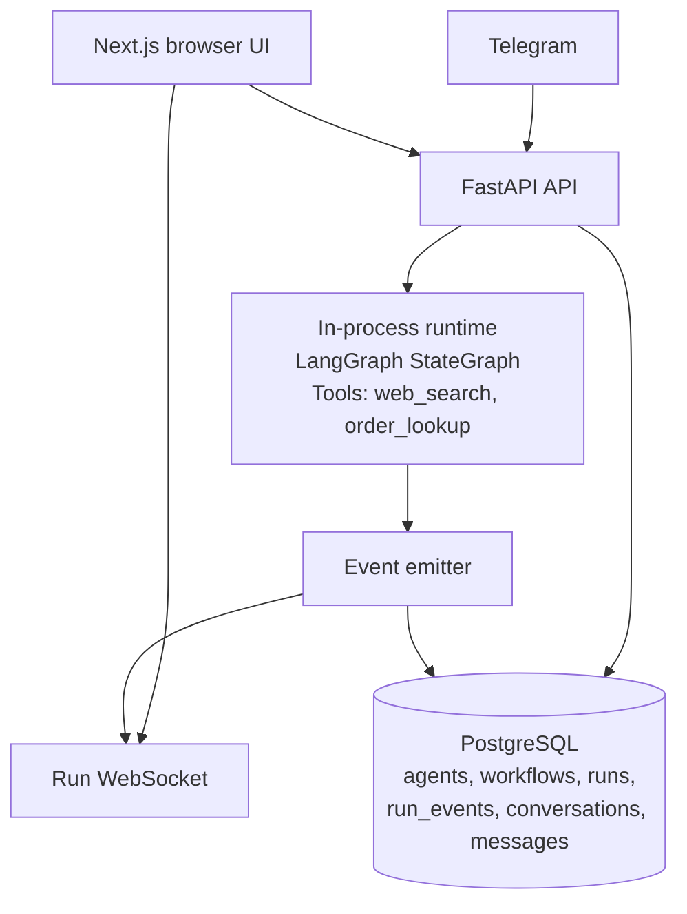

# AI Agent Orchestration Platform

Agent Mesh is a local-first platform for configuring agents, wiring them into LangGraph workflows, and watching runs stream live from the browser or Telegram. The demo focuses on one polished path: customer support triage that can be triggered from the UI or by a real Telegram chat.

## Demo

Demo video link: add Loom/OBS link after recording.

## Architecture



### Why these choices

- **LangGraph over CrewAI/AutoGen** because the demo needs explicit state transitions, native async execution, durable event checkpoints, and a simple single-process runtime that is easy to inspect during a live run.
- **FastAPI + Postgres** because Pydantic keeps the API contract tight, SQLAlchemy async fits the runtime, and Postgres JSON columns are a good match for flexible agent config and workflow graphs.
- **OpenAI-compatible model adapter** because it lets the same runtime use Anthropic, local Ollama models, OpenRouter free models, or Groq-style hosted open-weight models without rewriting agent execution.
- **Telegram polling for local demo** because it avoids ngrok and public HTTPS setup. The webhook endpoint is included for production-style deployment, where Telegram can call a public URL.
- **Single Postgres instead of Postgres + Redis + Qdrant** because this demo does not need RAG, Celery, or cross-replica WebSocket fanout. Fewer moving parts makes the cold-start demo much more reliable.

## Quick Start

```bash
cp backend/.env.example backend/.env
# Fill in OPENAI_COMPATIBLE_API_KEY, TAVILY_API_KEY, and optionally TELEGRAM_BOT_TOKEN
docker compose up --build
```

- UI: `http://localhost:3000`
- API docs: `http://localhost:8000/docs`
- Health: `http://localhost:8000/health`

On first boot, the backend logs the seeded Customer Support Triage workflow id and writes it to `backend/.telegram_workflow_id`. Copy that value into `backend/.env` as `TELEGRAM_DEFAULT_WORKFLOW_ID`, then restart the backend to enable Telegram routing.

## Model Setup

The default config uses OpenAI's `gpt-5-nano` through the OpenAI-compatible adapter:

```env
LLM_PROVIDER=openai_compatible
OPENAI_COMPATIBLE_API_KEY=sk-...
OPENAI_COMPATIBLE_BASE_URL=https://api.openai.com/v1
OPENAI_COMPATIBLE_MODEL=gpt-5-nano
DEFAULT_MODEL=gpt-5-nano
REQUIRE_ANTHROPIC_ON_STARTUP=false
INPUT_COST_PER_1K=0.00005
OUTPUT_COST_PER_1K=0.0004
```

The model id is `gpt-5-nano`; `gpt-5.4-nano` is not the public API model id.

### Free And Open-Weight Models

The runtime also supports any OpenAI-compatible endpoint.

For a truly free local setup, install Ollama and pull an open-weight model:

```bash
ollama pull qwen2.5:7b
```

Then set:

```env
LLM_PROVIDER=openai_compatible
OPENAI_COMPATIBLE_API_KEY=ollama
OPENAI_COMPATIBLE_BASE_URL=http://host.docker.internal:11434/v1
OPENAI_COMPATIBLE_MODEL=qwen2.5:7b
DEFAULT_MODEL=qwen2.5:7b
REQUIRE_ANTHROPIC_ON_STARTUP=false
INPUT_COST_PER_1K=0
OUTPUT_COST_PER_1K=0
```

Good local starter models:

- `qwen2.5:7b` - best first pick for tool-heavy demos on a laptop.
- `llama3.1:8b` - strong general model if your machine has enough memory.
- `mistral:7b` - smaller, fast, and usually good enough for a demo.

Hosted free options can work too, but have rate limits and availability changes. For OpenRouter, use an API key and a `:free` model:

```env
LLM_PROVIDER=openai_compatible
OPENAI_COMPATIBLE_API_KEY=your_openrouter_key
OPENAI_COMPATIBLE_BASE_URL=https://openrouter.ai/api/v1
OPENAI_COMPATIBLE_MODEL=qwen/qwen3-32b:free
DEFAULT_MODEL=qwen/qwen3-32b:free
REQUIRE_ANTHROPIC_ON_STARTUP=false
```

For local Telegram, keep:

```env
TELEGRAM_MODE=polling
```

For webhook deployments, set `TELEGRAM_MODE=webhook`, set `TELEGRAM_WEBHOOK_URL` to a public HTTPS URL, and configure Telegram to POST to `/api/v1/telegram/webhook`.

## Running The Demo

1. Open `http://localhost:3000` and confirm dashboard metrics load.
2. Open `/agents` and review the Triage Agent and Support Specialist.
3. Open `/workflows`, edit Customer Support Triage, and confirm the two-node graph loads.
4. Run Customer Support Triage with:

```text
Hi, I placed order ORD-1042 three days ago and the tracking link isn't working. Can you check the status and tell me what the standard delivery window is for international orders?
```

5. Watch `/runs/{id}` stream `node_started`, `tool_call`, `tool_result`, `agent_message`, and `run_completed`.
6. Send the same message to the configured Telegram bot.
7. Open `/conversations`, click the Telegram conversation, and use the `View run` link on the agent reply.

## What's Implemented Vs Stubbed

| Area | Status |
| --- | --- |
| Agent CRUD | Implemented |
| Workflow CRUD | Implemented |
| Visual workflow builder | Implemented with React Flow |
| Conditional edges / routing | Implemented (see `Smart Router` template) |
| LangGraph runtime | Implemented |
| Claude / OpenAI agent calls | Implemented |
| `order_lookup` tool | Implemented deterministic demo tool |
| `web_search` tool | Implemented (Tavily preferred, DDG fallback chain) |
| PII guardrails | Implemented (`guardrails.pii: redact` on agent config) |
| Rolling conversation memory | Implemented per (conversation, agent) |
| Live run timeline | Implemented over WebSocket |
| Telegram polling | Implemented |
| Telegram webhook route | Implemented, production path only |
| Conversations transcript | Implemented |
| Dashboard metrics + spend trend | Implemented (7-day token trend + per-agent cost) |
| Auth and multi-tenancy | Stubbed/deferred |
| Slack/WhatsApp | Stubbed/deferred (see [docs/EXTENDING.md](docs/EXTENDING.md)) |
| RAG/vector DB | Stubbed/deferred |
| Scheduling | Stubbed/deferred |

## Project Structure

- `backend/app/main.py` mounts FastAPI routers, startup DB init, seed data, and Telegram polling.
- `backend/app/api/` contains route modules for agents, workflows, runs, conversations, Telegram, and dashboard stats.
- `backend/app/integrations/telegram_bot.py` contains shared Telegram polling/webhook handling.
- `backend/app/runtime/` contains graph construction, tools, event emission, and workflow execution.
- `backend/app/models/` contains SQLAlchemy models.
- `backend/app/schemas/` contains Pydantic request/response models.
- `frontend/app/` contains Next.js App Router pages.
- `frontend/components/workflow/` contains React Flow workflow builder components.
- `frontend/lib/api-client.ts` contains the typed fetch wrapper.

## Extending The Platform

See [docs/EXTENDING.md](docs/EXTENDING.md) for how to add new tools, workflow templates, messaging channels, and guardrails. The Smart Router template demonstrates conditional edges; the Telegram integration is the reference channel adapter.

## Conditional Edges

Workflow edges support a `condition` object so that an upstream agent's decision can pick the next node:

```json
{
  "from": "triage",
  "to": "billing",
  "condition": {"route_equals": "billing"},
  "label": "billing"
}
```

The runtime parses `ROUTE:` or `CATEGORY:` lines from the last agent message and stores the value in workflow state. Edges with `condition.always: true` act as the catch-all default. See the seeded `Smart Router` template.

## Memory And Guardrails

- Memory: when an agent is configured with `memory_enabled: true` and the run is tied to a `conversation_id` (Telegram conversations always are), the runtime injects a rolling summary into the system prompt and rewrites that summary after the run completes. Storage: `conversation_memories` table.
- PII guardrails: agents with `config.guardrails.pii = "redact"` get email, phone, credit card, and IPv4 patterns redacted from incoming human messages before the LLM call. A `guardrail_triggered` event is emitted whenever a redaction fires so it is visible in the live run timeline.

## Tests

```bash
cd backend
pytest
```

The runtime integration test that calls Anthropic is marked `integration` and skips unless a real API key is configured.

## Production Roadmap

- Add auth, workspaces, and tenant isolation.
- Move WebSocket fanout to Redis for multi-replica deployments.
- Add a vector database only when an agent actually needs RAG.
- Add observability for run traces, model latency, and per-agent cost.
- Add secrets management for channel tokens and provider keys.
- Add durable background workers if runs need to outlive the API process.
