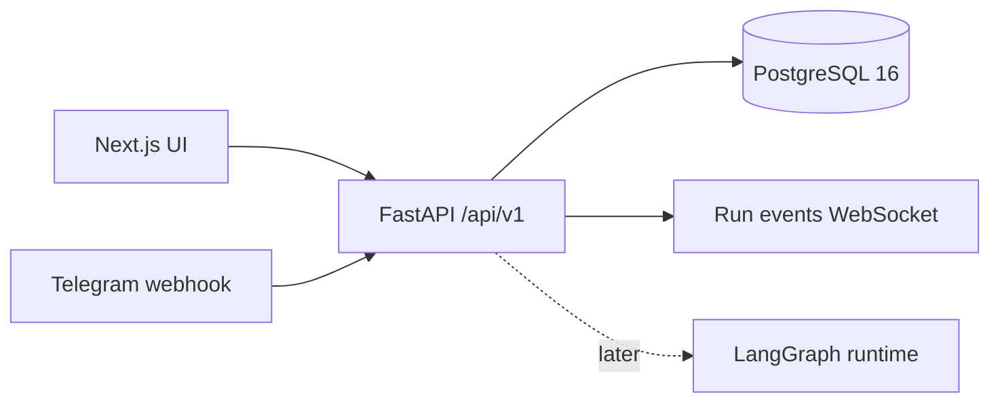

# Agent Mesh

Agent Mesh is a scaffolded AI agent orchestration platform for the Yuno AI Engineer hiring challenge. This phase locks the contract between a FastAPI backend and a Next.js frontend so UI work can proceed while the actual LangGraph runtime, channel routing, and agent execution are implemented later.

## Architecture



## Setup

```bash
docker compose up --build
```

Backend API docs: `http://localhost:8000/docs`

Frontend: `http://localhost:3000`

Health check: `http://localhost:8000/health`

## Folder Structure

- `backend/app/main.py` mounts the FastAPI app, routers, startup DB init, and seed data.
- `backend/app/api/` contains one route module per contract resource.
- `backend/app/models/` contains SQLAlchemy 2.0 models.
- `backend/app/schemas/` contains Pydantic v2 request and response models.
- `backend/app/websocket.py` exposes the stub run-events WebSocket.
- `frontend/app/` contains the Next.js App Router pages.
- `frontend/lib/api-client.ts` contains the typed fetch wrapper.
- `frontend/lib/types.ts` mirrors the backend contract and can be replaced by generated OpenAPI exports.

## OpenAPI and Types

Generate the contract:

```bash
cd backend
python -c "from app.main import app; import json; print(json.dumps(app.openapi()))" > ../openapi.json
```

Generate TypeScript OpenAPI types:

```bash
cd frontend
npm run generate:types
```

## What's Implemented

- FastAPI route stubs for agents, workflows, runs, conversations, Telegram webhook, health, and run WebSocket.
- SQLAlchemy tables matching the challenge contract.
- Pydantic response/request models for every endpoint.
- Idempotent seed data for sample agents and workflow templates.
- Next.js sidebar layout and stub pages.
- Fully working `/agents` page with list and create dialog.
- Contract smoke tests using FastAPI `TestClient`.

## What's Stubbed

- LangGraph runtime execution is not implemented yet.
- Telegram bot routing is not implemented beyond webhook persistence.
- React Flow workflow builder is not implemented yet.
- LLM calls, auth, schedules, real tool execution, and production-grade migrations are intentionally deferred.
