# AI Agent Orchestration Platform

Agent Mesh is a local-first platform for configuring agents, wiring them into LangGraph workflows, and watching runs stream live from the browser or Telegram. Three workflow templates ship out of the box (sequential support triage, research → summarize, and a conditional-edge Smart Router), with rolling per-conversation memory and PII guardrails enforced at the runtime level.

## Demo

Demo video: _(to be recorded — Loom/OBS link goes here)_.

Three pre-built workflow templates ship with the app:

- **Customer Support Triage** — Triage Agent → Support Specialist, with `order_lookup` + `web_search` tools.
- **Research & Summarize** — Researcher Agent (forced `web_search`) → Summarizer Agent.
- **Smart Router** — Triage Agent emits `ROUTE: billing|technical|general` and a conditional edge dispatches to the matching specialist; `condition.always: true` is the catch-all.

## Architecture

```mermaid
flowchart LR
  subgraph Channels
    Telegram[Telegram bot<br/>polling or webhook]
    Browser[Next.js UI<br/>React Flow builder]
  end

  Telegram --> API
  Browser -- REST --> API
  Browser <-- WS stream --> WSRouter

  subgraph Backend [FastAPI backend]
    API[REST routers<br/>agents · workflows · runs<br/>conversations · stats · telegram]
    Runner[workflow_runner<br/>execute_run]
    Graph[graph_builder<br/>LangGraph StateGraph]
    Guard[guardrails<br/>PII redact]
    Mem[memory<br/>rolling summary]
    Tools[tools<br/>web_search · order_lookup<br/>sql_query · calculator · send_email]
    Emit[event_emitter]
    WSRouter[WebSocket router<br/>/ws/runs/&#123;id&#125;]
  end

  API -- create Run, schedule task --> Runner
  Runner --> Graph
  Graph -- per-agent node --> Guard
  Graph --> Tools
  Graph -- inject summary --> Mem
  Graph --> Emit
  Runner -- summarize at end --> Mem
  Emit --> WSRouter
  Emit -- persist event --> DB
  Runner -- persist run/agents/workflow --> DB
  Mem -- conversation_memories --> DB

  DB[(PostgreSQL<br/>agents · workflows · runs<br/>run_events · conversations<br/>messages · conversation_memories)]
```



### Why these choices

- **LangGraph over CrewAI/AutoGen** because the demo needs explicit state transitions, native async execution, durable event checkpoints, and a simple single-process runtime that is easy to inspect during a live run. `add_conditional_edges` is also a clean fit for the Smart Router template.
- **FastAPI + Postgres** because Pydantic keeps the API contract tight, SQLAlchemy async fits the runtime, and Postgres JSON columns are a good match for flexible agent config and workflow graphs.
- **Pluggable model providers** — agents call OpenAI-compatible endpoints (OpenAI, Ollama, OpenRouter, Groq) by default. Anthropic models route through `langchain_anthropic.ChatAnthropic` instead. Either path uses the same agent definition, so the choice of model is per-agent and per-run.
- **Telegram polling for local demo** because it avoids ngrok and public HTTPS setup. The webhook endpoint is included for production-style deployment, where Telegram can call a public URL.
- **Single Postgres instead of Postgres + Redis + Qdrant** because this demo does not need RAG, Celery, or cross-replica WebSocket fanout. Fewer moving parts makes the cold-start demo much more reliable.

## Quick Start

```bash
cp backend/.env.example backend/.env
# Required: OPENAI_COMPATIBLE_API_KEY
# Optional: TAVILY_API_KEY (web_search falls back to DuckDuckGo if blank)
# Optional: TELEGRAM_BOT_TOKEN + TELEGRAM_DEFAULT_WORKFLOW_ID for the Telegram path
docker compose up --build
```

- UI: `http://localhost:3000`
- API docs: `http://localhost:8000/docs`
- Health: `http://localhost:8000/health`

On first boot, the backend logs the seeded Customer Support Triage workflow id and writes it to `backend/.telegram_workflow_id`. Copy that value into `backend/.env` as `TELEGRAM_DEFAULT_WORKFLOW_ID`, then restart the backend to enable Telegram routing.

### Telegram Bot Commands

Once polling is running, users can switch workflows per chat:

- `/start` — welcome + workflow picker
- `/workflows` — inline keyboard listing every seeded workflow; tap one to use it for this chat
- `/current` — show which workflow this chat is using (and whether the choice is per-chat or the server default)
- `/help` — command list

The per-chat selection is stored on the `conversations` row (`workflow_id` column). If a chat never picks one, messages fall back to `TELEGRAM_DEFAULT_WORKFLOW_ID`.

## Model Setup

The default config uses OpenAI's `gpt-5-nano` through the OpenAI-compatible adapter:

```env
LLM_PROVIDER=openai_compatible
OPENAI_COMPATIBLE_API_KEY=sk-...
OPENAI_COMPATIBLE_BASE_URL=https://api.openai.com/v1
OPENAI_COMPATIBLE_MODEL=gpt-5-nano
DEFAULT_MODEL=gpt-5-nano
REQUIRE_ANTHROPIC_ON_STARTUP=false
INPUT_COST_PER_1K=0.00005
OUTPUT_COST_PER_1K=0.0004
```

### Free And Open-Weight Models

The runtime also supports any OpenAI-compatible endpoint.

For a truly free local setup, install Ollama and pull an open-weight model:

```bash
ollama pull qwen2.5:7b
```

Then set:

```env
LLM_PROVIDER=openai_compatible
OPENAI_COMPATIBLE_API_KEY=ollama
OPENAI_COMPATIBLE_BASE_URL=http://host.docker.internal:11434/v1
OPENAI_COMPATIBLE_MODEL=qwen2.5:7b
DEFAULT_MODEL=qwen2.5:7b
REQUIRE_ANTHROPIC_ON_STARTUP=false
INPUT_COST_PER_1K=0
OUTPUT_COST_PER_1K=0
```

Good local starter models:

- `qwen2.5:7b` - best first pick for tool-heavy demos on a laptop.
- `llama3.1:8b` - strong general model if your machine has enough memory.
- `mistral:7b` - smaller, fast, and usually good enough for a demo.

Hosted free options can work too, but have rate limits and availability changes. For OpenRouter, use an API key and a `:free` model:

```env
LLM_PROVIDER=openai_compatible
OPENAI_COMPATIBLE_API_KEY=your_openrouter_key
OPENAI_COMPATIBLE_BASE_URL=https://openrouter.ai/api/v1
OPENAI_COMPATIBLE_MODEL=qwen/qwen3-32b:free
DEFAULT_MODEL=qwen/qwen3-32b:free
REQUIRE_ANTHROPIC_ON_STARTUP=false
```

For local Telegram, keep:

```env
TELEGRAM_MODE=polling
```

For webhook deployments, set `TELEGRAM_MODE=webhook`, set `TELEGRAM_WEBHOOK_URL` to a public HTTPS URL, and configure Telegram to POST to `/api/v1/telegram/webhook`.

## Running The Demo

1. Open `http://localhost:3000` and confirm the dashboard metrics, 7-day token trend, and per-agent spend table all render.
2. Open `/agents` and review the seeded agents (Triage, Support Specialist, Researcher, Summarizer, Orchestrator, Smart Router Triage, Billing/Technical/General Specialists).
3. Open `/workflows`, edit any template, and confirm React Flow renders the graph. `Smart Router` is the conditional-edge demo and `Customer Support Triage` is the Telegram default.
4. Run **Customer Support Triage** with an order question:

   ```text
   Hi, I placed order ORD-1042 three days ago and the tracking link isn't working. Can you check the status and tell me what the standard delivery window is for international orders?
   ```

5. Run **Smart Router** three times to exercise conditional routing:

   ```text
   I was charged twice on invoice INV-9012, please refund.        # → Billing Specialist
   My API integration is returning 503 errors on /v1/orders.      # → Technical Specialist
   How do I change my account display name?                       # → General Support Specialist
   ```

6. Trigger the PII guardrail by including an email + phone in the user input — a `guardrail_triggered` event appears in the run timeline with `EMAIL`/`PHONE` counts.
7. Watch `/runs/{id}` stream every event type: `run_started`, `node_started`, `llm_call`, `tool_call`, `tool_result`, `agent_message`, `guardrail_triggered`, `memory_updated` (Telegram only), `node_completed`, `run_completed`.
8. Send a message to the configured Telegram bot. Open `/conversations`, click the Telegram conversation, and use the `View run` link on the agent reply. Send a second message in the same chat to see the rolling summary picked up.

## What's Implemented Vs Stubbed

| Area | Status |
| --- | --- |
| Agent CRUD | Implemented |
| Workflow CRUD | Implemented |
| Visual workflow builder | Implemented with React Flow |
| Conditional edges / routing | Implemented (see `Smart Router` template) |
| LangGraph runtime | Implemented |
| Claude / OpenAI agent calls | Implemented |
| `order_lookup` tool | Implemented deterministic demo tool |
| `web_search` tool | Implemented (Tavily preferred, DDG fallback chain) |
| PII guardrails | Implemented (`guardrails.pii: redact` on agent config) |
| Rolling conversation memory | Implemented per (conversation, agent) |
| Live run timeline | Implemented over WebSocket |
| Telegram polling | Implemented |
| Telegram webhook route | Implemented, production path only |
| Conversations transcript | Implemented |
| Dashboard metrics + spend trend | Implemented (7-day token trend + per-agent cost) |
| Auth and multi-tenancy | Stubbed/deferred |
| Slack/WhatsApp | Stubbed/deferred (see [docs/EXTENDING.md](docs/EXTENDING.md)) |
| RAG/vector DB | Stubbed/deferred |
| Scheduling | Stubbed/deferred |

## Project Structure

- `backend/app/main.py` — FastAPI bootstrap (router mount, DB init, seed, Telegram lifecycle).
- `backend/app/api/` — REST routers: `agents`, `workflows`, `runs`, `conversations`, `telegram`, `stats`.
- `backend/app/integrations/telegram_bot.py` — shared Telegram polling + webhook handling (forwards `conversation_id` into the runner for memory).
- `backend/app/runtime/` — workflow runtime:
  - `graph_builder.py` — LangGraph `StateGraph` build, conditional edges, route extraction.
  - `workflow_runner.py` — Run lifecycle, memory summarization, event totals.
  - `tools.py` — tool implementations + `TOOL_REGISTRY` (web_search, order_lookup, sql_query, calculator, send_email).
  - `guardrails.py` — PII redaction.
  - `memory.py` — rolling-summary read/write.
  - `event_emitter.py` — persist `RunEvent` + WebSocket broadcast.
- `backend/app/models/` — SQLAlchemy models (`agents`, `workflows`, `runs`, `run_events`, `conversations`, `messages`, `conversation_memories`).
- `backend/app/schemas/` — Pydantic request/response models.
- `backend/alembic/versions/` — schema migrations (`0001` initial → `0003` memory + guardrail event types).
- `backend/tests/` — `test_contract.py` (REST + WebSocket) and `test_runtime.py` (graph build, tools, guardrails, routing, memory).
- `frontend/app/` — Next.js App Router pages (dashboard, agents, workflows, runs, conversations, settings).
- `frontend/components/workflow/` — React Flow nodes, palette, edge styling.
- `frontend/lib/api-client.ts` — typed fetch wrapper.
- `docs/EXTENDING.md` — how to add tools, templates, channels, guardrails.

## Extending The Platform

See [docs/EXTENDING.md](docs/EXTENDING.md) for how to add new tools, workflow templates, messaging channels, and guardrails. The Smart Router template demonstrates conditional edges; the Telegram integration is the reference channel adapter.

## Conditional Edges

Workflow edges support a `condition` object so that an upstream agent's decision can pick the next node:

```json
{
  "from": "triage",
  "to": "billing",
  "condition": {"route_equals": "billing"},
  "label": "billing"
}
```

The runtime parses `ROUTE:` or `CATEGORY:` lines from the last agent message and stores the value in workflow state. Edges with `condition.always: true` act as the catch-all default. See the seeded `Smart Router` template.

## Memory And Guardrails

- Memory: when an agent is configured with `memory_enabled: true` and the run is tied to a `conversation_id` (Telegram conversations always are), the runtime injects a rolling summary into the system prompt and rewrites that summary after the run completes. Storage: `conversation_memories` table.
- PII guardrails: agents with `config.guardrails.pii = "redact"` get email, phone, credit card, and IPv4 patterns redacted from incoming human messages before the LLM call. A `guardrail_triggered` event is emitted whenever a redaction fires so it is visible in the live run timeline.

## Tests

```bash
cd backend
PYTHONPATH=. pytest
```

The end-to-end `test_run_completes_end_to_end` is marked `integration` and skips unless a real LLM API key is set (`ANTHROPIC_API_KEY` for the Anthropic path, or a working `OPENAI_COMPATIBLE_API_KEY` env for the OpenAI-compatible path). Unit coverage includes graph build, PII redaction, route extraction, conditional routing, and memory injection.

## Production Roadmap

- Add auth, workspaces, and tenant isolation.
- Move WebSocket fanout to Redis for multi-replica deployments.
- Add a vector database only when an agent actually needs RAG.
- Add agent scheduling (cron / interval triggers via APScheduler).
- Add tracing (OpenTelemetry) for model latency and per-tool spans.
- Add secrets management for channel tokens and provider keys.
- Add durable background workers if runs need to outlive the API process.
